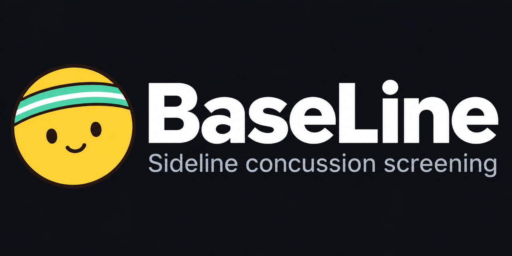

<p align="center"></p>

# Baseline

A browser-based sideline concussion screen that compares each athlete to their own healthy baseline.

*A little Dot, a bigger purpose. Every athlete deserves a baseline.*

**[Live demo](https://baselinetest.web.app)** · **[Short demo run (?quick)](https://baselinetest.web.app/?quick)**

Built for **Dream Team Engineering Designathon 2026, Software track**: a technology-based solution addressing a health-related challenge in sports, physical activity, or athletic participation.

## The problem

- After a hit, a sideline coach needs a clear way to identify changes that warrant medical evaluation.
- An athlete's usual performance matters: the same score can mean different things for different people.
- Baseline tests and post-hit checks need to be accessible on ordinary phones and laptops, with results available to the athlete and coach.

## What it does

Athletes record healthy baseline trials, then repeat the tests after a hit. Baseline compares the new measurements with that athlete's saved baseline and produces **Normal**, **Monitor**, or **Remove from play and refer**.

| Test | Device and procedure | Measurements |
|---|---|---|
| Balance | Phone motion sensor; phone against chest, eyes closed, three 20-second stances: feet together, single leg, heel-to-toe | Average sway, single-leg sway (cm/s²), and errors: the examiner's count, pre-filled with the stumbles the phone detected so a step is never counted twice |
| Reaction time | Phone or laptop; tap when the target turns green, with 3 practice and 15 scored trials | Median response time, spread of response times, early taps and missed signals |
| Eye pursuit | Webcam or front camera; MediaPipe tracks eye landmarks through calibration and a moving-target task | Time on target, pursuit gain, catch-up saccade rate, lag; tracking error is stored but not scored |

The phone eye-test variant, **`eyePhone`**, has its own baseline, separate from laptop **`eye`**, because camera, screen size, and viewing distance differ.

**Run all three** guides the athlete through reaction, eyes, then balance, with a combined save step and overall call. Spoken instructions are available for reaction and eyes and automatic for balance; beeps and vibration provide additional cues where supported. Individual tests are also available.

Dashboards show baseline progress and trends. History includes saved results, deletion, and CSV export; coaches can export the team's results. Baseline completion is marked at three trials per test, and every trial counts toward the baseline.

## Design and experience

Baseline is built for a coach on a loud sideline and a young athlete who may never have taken a test like this, so it aims to be calm, clear, and friendly.

- **Dot, the mascot:** a round character in a sports headband who appears throughout the app. Each test opens with a short animated demo of Dot doing it (following the dot with its eyes, tapping the target, holding a stance), so athletes see what to do before they start.
- **Guided tour:** first-time users get a short tour from Dot, and the **Tutorial** button in the header replays it at any time.
- **Dot pictures:** emoji and test icons are custom Dot artwork in `public/emoji/`, so they look the same on every device instead of depending on the phone's emoji font.
- **Profile pictures:** everyone can upload a photo (cropped and shrunk on the device) or pick one of six Dot pictures; teammates and coaches see it beside the name.
- **Light and dark mode:** follows the device setting by default, with a toggle in the header.
- **Phone and laptop layouts:** phones get a bottom tab bar and single-column screens; laptops get centered tabs with a sliding highlight and wider dashboards.
- **Plain language:** every call comes with what it means and what to do next, written for coaches and athletes rather than clinicians.

For a demo-length run during a short pitch, open the app with [`?quick`](https://baselinetest.web.app/?quick): the guided flow uses shorter versions of each test (5 reaction trials, 8-second balance stances, a shorter eye sweep and calibration).

## Roles and privacy

Coaches create and manage up to ten teams. Athletes can join up to ten teams with a six-character code or a QR invite opening `?join=CODE`; the invite survives signup and offers another team to athletes who are already signed in. Each athlete has one result record shared with the coaches of all their teams, so joining another team never requires new baselines.

| Capability | Athlete | Coach |
|---|---|---|
| Record a baseline | Own baseline only | Cannot record athletes' baselines |
| Run a post-hit check | Self or anyone on any shared team | Any athlete on any coached team |
| View saved scores, trends, and history | Own results only | Full records of athletes on coached teams |
| Delete results | Own results | Results of athletes whose profile grants access |
| Medical history (prior concussions, ADHD, vision, balance problems) | Enter and edit their own across all teams | See each athlete’s, beside their results |
| Manage membership | Join or leave individual teams | Create teams, invite or remove athletes per team |

Coach Home combines all athletes, flagged first, with team tags and a team filter. The Team tab has a separate roster and invite card for every team. The check picker groups athletes by team; someone on multiple teams may appear in multiple groups, but still has only one result record.

A teammate running a check sees **only the call and action, never the athlete's numerical results in the UI**. The testing device processes the new measurements and judges them against published baseline cutoffs in `ranges/{teamId}`. These documents contain cutoffs and baseline trial counts, not trial results. The new result is saved for the athlete and coach; the teammate cannot read it back.

[Realtime Database rules](database.rules.json) enforce result access, allowed fields, and deletion rights. Athletes query only their own trials; coaches subscribe once per athlete across their teams. Teammates can submit checks but cannot read another athlete's record. Team members can read rosters and published ranges; the athlete publishes cutoffs to every team they belong to. This protects stored results, but the tester's device still handles the current measurement and computes its status.

Coaches receive in-app alerts for checks run by others that return Monitor, Refer, or No baseline. Optional browser notifications work while the app is open, including in a background tab.

A consent screen explains screening limits and data use before first use and records the immutable `consentedAt` timestamp. Signup and onboarding show a notice that **users under 18 must have a parent or guardian read the privacy notice and agree before use**. There is no minimum-age checkbox or age-confirmation requirement, and the app does not collect a birth date. Older `ageConfirmedAt` values remain compatible with existing profiles but are no longer requested or required. The privacy notice remains accessible from the footer.

The notice covers account/profile information, team memberships, scores and screening calls, derived baseline cutoffs, entered testing conditions and medical history, optional profile pictures, and confirmation dates. **No raw camera video or motion recordings are uploaded**; an optional cropped profile photo is stored separately. Current coaches can access an athlete’s full saved result history across teams. The testing device handles the current measurement and may retain an upload queue even when the tester cannot browse that athlete’s saved record. Signed-in team lookups expose team metadata; authorized project administrators and Firebase service processing are separate from team-member permissions.

Firebase Authentication manages sign-in and Realtime Database stores active shared records. Browsers retain sign-in state, preferences, durable IndexedDB upload queues, and possibly legacy Firestore caches. Signing out does not erase all stored browser data. Leaving a team removes its membership, history, avatar and cutoff copies, and revokes that coach’s result access unless another shared team remains; the athlete’s results are retained. Result deletion removes the active record, not automatically legacy database copies, administrative backups, exports, or previously retained device data. Full account deletion is not self-service: requests require the app administrator. See [Firebase privacy and security](https://firebase.google.com/support/privacy) for the provider’s processing information.

## How scoring works

[shared/assess.js](shared/assess.js) defines the metric directions, baseline summaries, published cutoffs, and per-test decisions.

1. Compute each metric's mean and sample standard deviation across the saved baseline trials (three are recorded; all of them count).
2. Use an effective spread equal to the largest of the standard deviation, 10% of the absolute mean, the metric's floor, and a tiny numerical floor (`1e-9`). Error and mistake counts have a spread floor of 1.
3. Flag a metric only when it is more than **3 spreads worse** than the mean: above `mean + 3 × spread` for higher-is-worse metrics, or below `mean - 3 × spread` for lower-is-worse metrics. (It was 2; see the false-alarm numbers below.)

| Flagged metrics in one test | Call |
|---|---|
| 0 | Normal |
| 1 | Monitor |
| 2 or more | Remove from play and refer |

The [overall call](src/lib/status.js) is Refer if any included test is Refer or at least two tests are Monitor; one Monitor yields Monitor. Otherwise it is Normal. A check without a baseline is stored as `no-baseline`: it can't be compared, so it doesn't count toward the overall call, and the tester is told to sit the athlete out if they took a hard hit or have symptoms. There is no team-average fallback. Missing or non-finite metric values are skipped during comparison.

**This is a screening tool, not a diagnosis. The cutoffs are not clinically validated yet.** A normal result cannot rule out concussion or clear an athlete to return to play. Anyone with a suspected concussion should be removed from play and evaluated by a clinician regardless of the app's call. A clinical validation study is the next step.

### How often a healthy athlete gets flagged

With only a few baseline trials the sample SD is a rough estimate, so a fixed cutoff fires on healthy athletes more often than the normal-distribution math suggests. Simulated with the app's own spread rule (`node scripts/falsepositives.mjs`), eight scored metrics, a healthy athlete, and the current **3-spread** cutoff:

| Metric's real trial-to-trial variation | 3 baseline trials: any flag / "refer" | 5 trials: any flag / "refer" |
|---|---|---|
| 5% of its mean | 0% / 0% | 0% / 0% |
| 10% | 4% / 0.1% | 2% / 0% |
| 20% | 28% / 4% | 16% / 1% |
| 30% | 35% / 6% | 18% / 2% |

At the old 2-spread cutoff the false "refer" rate was about 3%, 17% and 20% for the last three rows. A whole-call simulation (three tests, one test truly 3 SD worse for the "concussed" case) gave: healthy athletes told "remove from play" 0.1-5.5% of the time (was 5-24%), and a real drop still reaching at least "monitor" 79-94% of the time. Recording five baseline trials instead of three roughly halves the remaining false alarms. These cutoffs are a sensitivity choice, not a clinical validation; measure real healthy retests before relying on them.

## Testing protocol (and why)

Every result is compared to the athlete's **own baseline**, so anything that differs between the baseline and the check can look like a concussion. The protocol keeps conditions the same, and the app enforces or records what it can.

**Set up a testing station.** A shaded, quiet spot with a firm floor and the athlete's back to the field: behind the bench or in the medical tent. They aren't watching the game, there's no crowd in the camera's view, and the light is consistent. **Record baselines in the same kind of spot**, on the same type of device.

**Before every test the app asks five questions** ([ConditionsGate](src/components/ConditionsGate.jsx)), and saves the answers with each result:

| Question | Why it matters | What the app does |
|---|---|---|
| Rested 15+ min since playing? | Hard exercise alone degrades balance and reaction time for about 15–20 minutes (documented for the BESS balance test). An athlete pulled straight off the field looks impaired because they just sprinted. | Offers a 15-minute rest timer; a baseline taken without rest gets a redo prompt. |
| Quiet spot or loud sideline? | Noise distracts the athlete and can drown out audio cues. Noise doesn't affect the camera model. | Suggests moving behind the bench or into the tent. |
| Indoors, shade, or direct sun? | Sun washes out the reaction screen and puts the face in shadow (bad for eye tracking). | Suggests moving into shade. |
| Overheated, or no water in the last hour? | Heat and dehydration slow thinking and balance on their own. | Suggests water and shade first; a baseline taken that way gets a redo prompt. |
| Any other injury or pain right now? | Pain, a limp, or fear of an injury makes every test worse, and it isn't concussion. | Noted with the result; a baseline taken that way gets a redo prompt. |

The device type (phone or laptop) is saved too. Flagged conditions show as tags in History and as columns in the CSV export, so we can later check which confounds actually moved the numbers.

**Eye test camera checks** (before Start): one face in view (the model is asked for two faces so it can notice a bystander, and refuses to start if there are two), close enough to the camera, face well lit and not backlit, camera steady (propped up, not hand-held), facing the screen, and eyes open. A second face appearing mid-test triggers a "retest" warning.

**Balance cues:** the phone is pressed to the chest, so on phones that can vibrate a long buzz means "close your eyes" and three short pulses mean "open them", with the beep and voice as backup. iPhone browsers don't support the vibration API; on iOS 18+ the app uses an unofficial workaround (toggling a hidden switch control, which plays a real haptic tick), so iPhones get a lighter tapping buzz. Sound remains the main cue on iPhones. The preflight **Check sound** button plays a tone and speech after a tap, and the app resumes suspended audio before scheduling cues. Where supported, it requests an [AudioSession playback mode](https://bugs.webkit.org/show_bug.cgi?id=237322) that allows the ringer to stay off. Keep media volume up; Focus or Do Not Disturb can reduce interruptions. Older browsers may still require Silent mode off. Confirm both tone and voice are audible before closing your eyes; browser API checks cannot verify the speaker, volume, or Bluetooth output.

**Baseline sanity checks** ([lib/validity.js](src/lib/validity.js)): a baseline far worse than a healthy athlete usually scores (very slow reactions, eyes not keeping up with the dot, many balance errors) gets a "redo?" prompt before saving. A poor baseline, whether from a bad setup or deliberately doing badly ("sandbagging", a known problem with baseline tests), makes later checks look fine. The cutoffs are generous starting points to be tuned with volunteer data.

**Pre-existing conditions** (prior concussions, ADHD, vision problems, vestibular or balance problems) shift what a normal result looks like and how long recovery takes. Athletes record them on the Team tab ([MedicalHistory](src/components/MedicalHistory.jsx)); the coach sees them beside that athlete's results. They are private to the athlete and each team's coach (`history/{teamId}/{uid}`), never on the roster teammates can read. Sessions merge history across teams by the newest `updatedAt` per athlete. Saving writes the same history to every current membership; joining another team copies the current history in the same atomic membership update.

**Practice effects:** the first attempt at an unfamiliar test is often the worst, and a bad early trial widens the baseline's spread and can hide a later deficit. Baselines are three trials and every trial counts. `PRACTICE_TRIALS` in [shared/assess.js](shared/assess.js) can drop leading trials from scoring if the team adds a warm-up trial; it is 0 for now. Reaction time has its own three unscored practice taps inside each run.

**Other confounds to watch for** (not yet measured by the app): sleep, caffeine, medication, and age (re-baseline every season).

## Tech stack

- **React + Vite** for the interface and build.
- **MediaPipe FaceLandmarker**, a pretrained model running in the browser, for camera-based eye landmarks; the model and WebAssembly assets are served with the app.
- **DeviceMotion API** for balance sensing; browser speech, audio, and vibration APIs for cues.
- **Firebase Authentication** with email/password and password reset; **Firebase Realtime Database** for shared live records and an **IndexedDB upload queue** for pending results; **Firebase Hosting** for deployment.
- **Installable PWA** with a manifest and production service worker that caches the app shell and fetched assets. The upload queue durably stores each result before sending it and replays the same result ID after reconnection or a reload.
- **No custom backend server or deployed scoring function**: measurement and scoring run on the client.

An already-loaded session can queue results while offline. Opening the app from scratch, loading shared records, joining teams, and changing account settings need connectivity. Pending results survive a reload in IndexedDB and resume uploading when the app reconnects. A result is marked saved only after the database acknowledges it. Sign in to the same account on each device to receive the same live records.

## Data model

Access rules are generated from [scripts/generate-database-rules.mjs](scripts/generate-database-rules.mjs) into [database.rules.json](database.rules.json). Firebase Authentication still manages the same accounts and passwords.

```text
profiles/{uid}                     # owner-only profile
  role, name, consentedAt?, ageConfirmedAt?, teamIds: { teamId: true }
teams/{teamId}                     # team metadata, no private records
  name, coachUid, coachName, code, createdAt
joinCodes/{code}                   # single-code lookup, no enumeration
  teamId
members/{teamId}/{uid}
  name, code, joinedAt
recordReaders/{athleteUid}/{coachUid}/{teamId}: true
trials/{subjectUid}/{trialId}       # athlete + their current coaches only
  subjectUid, testerUid, test, kind: baseline | check, at, metrics
  teamId?, status?                 # required for checks
  conditions?: { rested, place, light, device, heat, pain }
ranges/{teamId}/{subjectUid}_{test} # published cutoffs for teammates
  subjectUid, test, n, limits: { metric: { worse, limit } }
history/{teamId}/{uid}             # athlete + team coach only
  concussions, adhd, vision, vestibular, updatedAt
avatars/{teamId}/{uid}             # roster-visible picture, owner writes
  kind: photo | dot | none, photo?, dot?, updatedAt
```

`test` is `balance`, `reaction`, `eye`, or `eyePhone`. Timestamps are ISO strings. Trial metric values are bounded numbers or `null` when unavailable:

| Test | Exact `metrics` fields |
|---|---|
| `balance` | `sway`, `singleSway`, `errors` |
| `reaction` | `medianMs`, `spreadMs`, `mistakes` |
| `eye`, `eyePhone` | `onTarget`, `gain`, `saccadeRate`, `lagMs`, `trackingError` |

Joining, leaving, and removing a member update membership, profile links, and coach read grants atomically. A coach loses access after the last shared team is removed; the athlete keeps their results. Scoped live listeners update all connected devices without polling. Cutoffs are only rewritten when their values change.

The Firestore migration preserves stable result IDs, merges duplicate legacy records, rebuilds access grants from actual memberships, and verifies a checksum after importing. Source records and a local backup are retained. Refreshed clients disable Firestore networking and recover pending results from that browser's old cache into the durable upload queue. Refresh every phone and computer after the cutover; an old open page still runs the old Firestore client. Keep browser data until its results are confirmed saved.

The project uses the **Spark no-cost plan**. Realtime Database avoids Firestore's daily document-write quota, but still has free-plan connection, storage, and download limits. Exceeding those limits can interrupt service; it does not turn Spark into paid usage. See [Firebase pricing](https://firebase.google.com/pricing). Do not upgrade to Blaze if the requirement is no paid usage.

## Running locally

Use Node.js/npm compatible with Vite 8. Copy `.env.example` to `.env.local` and fill in the Firebase web config. Ask a teammate for the values or retrieve them with an authorized Firebase CLI session:

```bash
firebase apps:sdkconfig WEB --project dte-hackathon
npm install
npm run dev
```

`npm install` also copies MediaPipe WebAssembly files into `public/`. The face model is in `public/models/`. The default local URL is `http://localhost:5173`.

For phone sensors and camera testing on the same LAN:

```bash
npm run dev:phone
```

Open the HTTPS network URL printed by Vite on the phone and accept the local development certificate if prompted. Grant camera/motion permissions as requested; phone mode uses a self-signed HTTPS certificate.

For logged-in screen previews without an account, development builds expose the **`__previewSession`** browser-console hook from [src/lib/session.js](src/lib/session.js). It accepts a partial session state with mock profile, `teams`, `members`, `trials`, and `ranges` maps. Members include their `teamIds`; set `trialsReady: true` to preview dashboards. This changes local UI state only; it does not authenticate Firebase writes and is omitted from production builds.

Run the local session regression checks without contacting the live project:

```bash
node --test scripts/session.test.mjs
```

```bash
npm test                       # scoring, sessions, upload queue, cache recovery, migration
node scripts/falsepositives.mjs  # how often the scoring rule flags a healthy athlete
```

### Deployment

Set `VITE_FIREBASE_DATABASE_URL` in `.env.local` along with the existing Firebase web config. The database is `https://dte-hackathon-default-rtdb.firebaseio.com`.

Install Firebase CLI and Java 21+ to run real security-rule and two-client listener tests locally:

```bash
node scripts/generate-database-rules.mjs
npm run test:rules
npm test
npm run build
firebase deploy --only database,hosting --project dte-hackathon
```

[firebase.json](firebase.json) serves `dist/` on the `baselinetest` Hosting site and deploys `database.rules.json`. Firestore rules are retained for the legacy source; new clients do not send application writes to Firestore.

The one-time administrative migration uses an existing authorized Firebase CLI login; it creates no service-account keys. Set `FIREBASE_TOOLS_ROOT` to the installed `firebase-tools` package directory. Run `node scripts/migrate-realtime.mjs` to export a backup under ignored `.firebase/migration/`, then `node scripts/migrate-realtime.mjs --apply <backup-path>` to import into an empty database. It refuses to overwrite an existing different dataset and verifies the result checksum. Backups contain private data and must not be committed.

For a final cutover check, export again and run `node scripts/migrate-realtime.mjs --reconcile <previous-backup> <fresh-backup> --dry-run`. Without `--dry-run`, only newly exported result IDs are conditionally created; existing results and membership permissions are never overwritten. Inspect reported conflicts or account/team changes. Use the fresh successfully reconciled backup for subsequent comparisons. A result recovered and then deleted on a device before reconciliation cannot be distinguished from a never-imported late result without deletion history; refresh old clients promptly.

## Code layout

[scripts/demo-data.mjs](scripts/demo-data.mjs) builds deterministic fictional records for one coach and four athletes, with normal, monitor, refer, and incomplete-baseline examples. It derives result labels using the app's scoring functions, keeps phone and laptop eye baselines separate, and never creates accounts or fabricates consent. Demo credentials are not stored in source code.

```text
src/
  App.jsx                  Authentication/consent gates and role-specific navigation
  main.jsx                 React entry, invite capture, production service worker
  brand.jsx, styles.css    Branding and responsive styles
  pages/
    AuthScreen.jsx         Email/password signup, login, password reset
    Setup.jsx, Team.jsx    Profiles, team setup, roster, invitations, membership
    Overview.jsx           Dashboard, trends, baseline progress, test guide
    RunTest.jsx, Flow.jsx   Individual test selection and guided three-test flow
    History.jsx            Saved results, deletion, CSV download
    Privacy.jsx            Consent screen and privacy notice
  tests/
    registry.js            Test definitions and phone/laptop eye result variants
    balance/               Motion capture, stance scoring, test UI
    reaction/              Tap timing, reaction metrics, test UI
    eye/                   Camera landmarks, calibration, pursuit scoring, plots
  lib/
    firebase.js            Auth, RTDB initialization, legacy cache access
    session.js             Live state, team/trial writes, published cutoffs
    outbox.js              Durable per-account result uploads and retries
    legacyRecovery.js      Recovery of pending results from old browser caches
    baseline.js, status.js  Baseline comparisons, CSV export, overall calls
    alerts.js, invite.js    Coach alert grouping and join-link handling
    cues.js, focus.js       Speech/audio/vibration and test focus behavior
  components/              Result cards, trends, alerts, QR codes, shared UI
shared/
  assess.js                Shared scoring definitions and cutoff calculation
```

## Next steps and limitations

- **Clinical validation:** measure repeatability and compare screening calls with clinician assessments before claiming diagnostic accuracy or effectiveness.
- **Trusted scoring:** move teammate-check scoring to a Cloud Function so a tampered phone cannot submit a fabricated status. Current rules validate access and data shape, not the calculation.
- **Rollout follow-up:** refresh all older clients and confirm their locally queued results have uploaded. The Firestore source remains available for administrative recovery; new clients use only Realtime Database for shared records.
- **Measurement quality:** device latency, lighting, head motion, sensor support, fatigue, and test setup can affect results. Keep baseline and check conditions consistent. Skipped tests or missing metrics reduce what the overall call covers.

## Dot collection preview

The separate [Dot collection page](https://baselinetest.web.app/merch) previews a tee, puffer jacket, and softshell jacket inspired by the collection concept. It is linked from sign-in and the app footer, with a return link to Baseline. The main app and existing team invitation links keep their current URLs.

The collection is **coming soon**: images show design concepts, with final products, pricing, and launch timing still to be confirmed. There is no checkout or payment collection. The stated pledge is that **100% of profits will support concussion research**, with the research recipient and donation details to be announced before sales open. The public page does not load the app’s Firebase data subscriptions.
